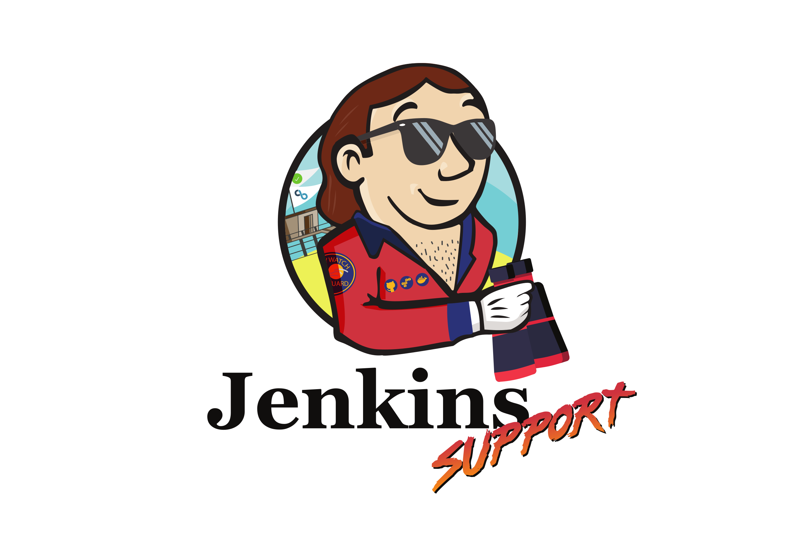

# My Jenkins Demos

This repo contains code for **demos**

* [Jenkinsfile](resources/pipelines)
* [Jenkins Shared Libraries](vars) and [Groovy src](src)
* [CloudBees Pipeline Templates](templates)
* [Configuration as Code (CasC) for Masters](resources/casc)
* [Jenkins CLI](resources/cli)
* [Jenkins API-REST](resources/rest-api)
* [K8](resources/k8s)
* [Docker](resources/docker)

Demo repositories for builds: https://github.com/jenkins-demo

## Reference

### Other Jenkins Demo repos

* [CloudBees Solutions Architecture Pipeline Examples](https://github.com/beedemo)
* [Jenkins Demonstrations](https://github.com/jenkins-demo)

### Docs

* [Write Groovy scripts for Jenkins with code completion](https://www.mdoninger.de/2011/11/07/write-groovy-scripts-for-jenkins-with-code-completion.html)
* [Pipeline Shared Libraries and Template Catalogs](https://www.cloudbees.com/blog/pipeline-as-code)
